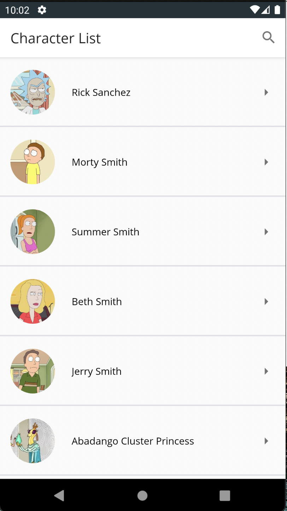
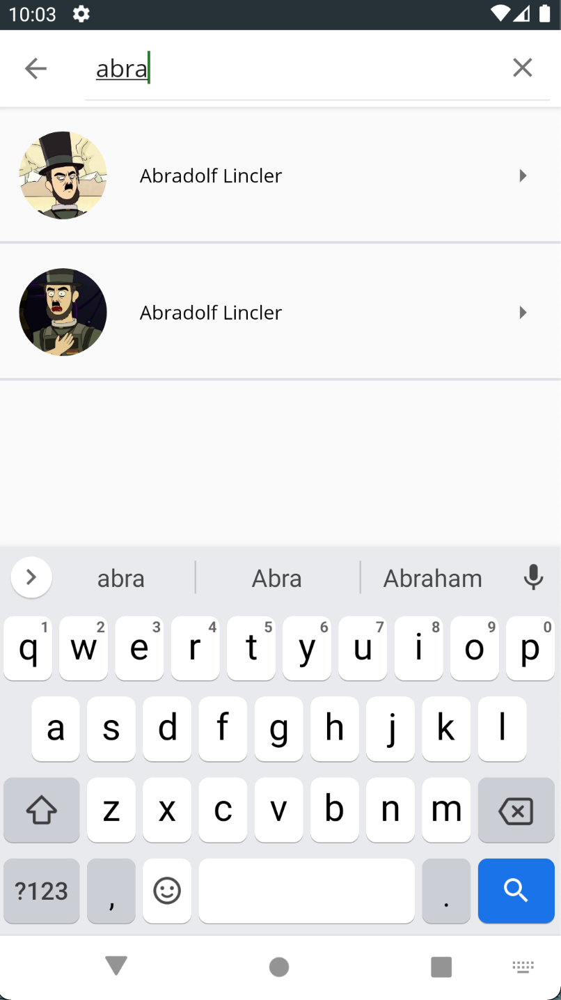
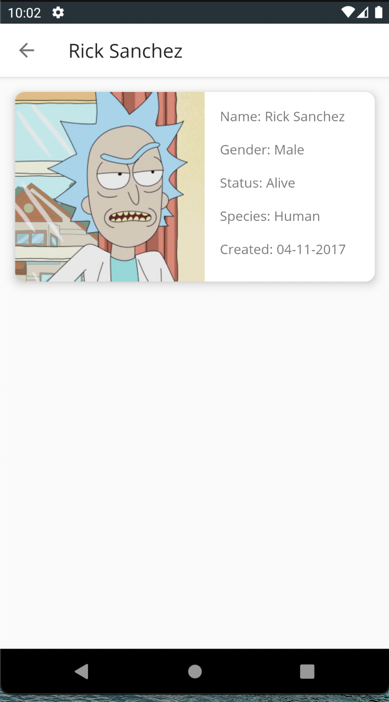

# RickAndMorty-TestTask
Тестовый 'Гайд по мультфильму Рик и Морти' для практикантов начального и продвинутого уровня.

## Структура проекта
Структура проекта построена по принципу Clean Architecture.\
*`network`* - слой, содержащий классы для работы с сетью построитель сетевых запросов, API backend methods интерфейс.\
Фабрику, адаптер и модель сетевого ответа.\
*`data`* - слой, содержащий репозитории, отправляющие данные в domain-слой, реализуя предоставляемый доменом интерфейс.\
*`domain`* - слой, описывающий бизнес логику приложения. Содержит интерфейсы UseCases и реализующие их сервисы.\
*`ui`* - слой, содержащий компоненты пользовательского интерфейса.\
*`di`* - вспомогательный пакет для внедрения полезных зависимостей в приложении.\
*`model`* - слой описывающий модели данных необходимы для передачи и отображения на UI слое.\
*`utils`* - вспомогательный пакет, для упращения работы с UI слоем, содержащий в себе классы адаптеры для привязки данных и extension функции.\
*`buildSrc`* - модуль приложения, предназначенный для внедрения сторонних библиотек в приложении, написанный на Kotlin DSL.\

## Используемые технологии
- Retrofit
- Coroutines
- Koin
- Glide
- Navigation Architecture Component

## Дизайн-макет приложения

## Демонстрация работы приложения

